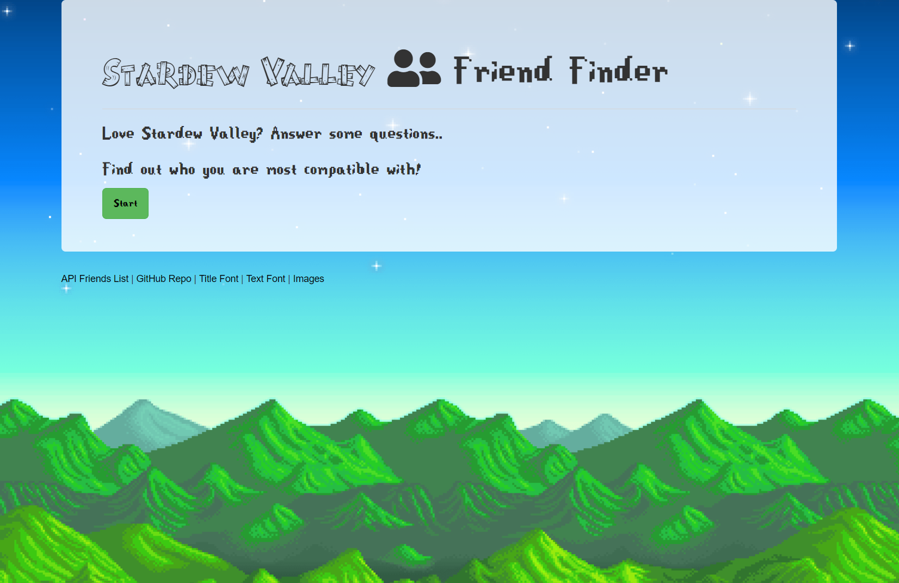
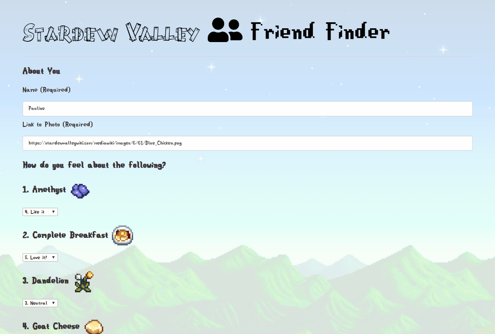

# Friend Finder - Node and Express Servers

[https://stardewfriendfinder.herokuapp.com/](https://stardewfriendfinder.herokuapp.com/)

### Overview

Friend Finder is a compatibility based matchmaking application with a Stardew Valley theme. Users answer survey questions and are matched to the most compatible Stardew Valley character or other user based on each preference.

### Details

1. `server.js` configures the server and app rendering

2. `htmlRoutes.js` handles the page routing:

   * A GET Route to show `/survey` page
   * A default, catch-all route leading to `home.html` page

3. `apiRoutes.js` handles API routing:

   * A GET route for `/api/friends` to display a JSON of all possible friends.
   * A POST route `/api/friends` to handle incoming survey results and compatibility logic.

4. `friends.js` holds initial friends data for compatibility comparisons.

### Technology used

CSS3

Express

Heroku

HTML5 

Javascript

JQuery

Node